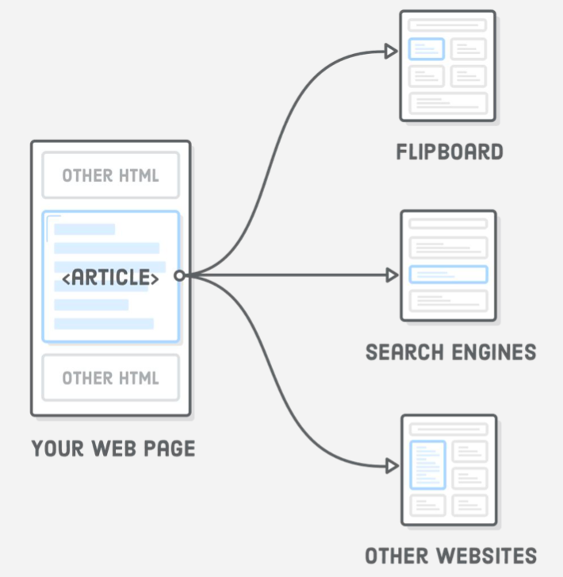

# article

Elementas `<article>` reiškia nepriklausomą tinklalapio straipsnį. Jis turėtų apimti tik turinį, kurį galima paimti/ištraukti iš jūsų puslapio ir platinti visiškai kitame kontekste. Pavyzdžiui, tokia programa kaip "Flipboard" turėtų sugebėti nuskaityti `<article>` elementą iš jūsų svetainės, rodyti jį savo programoje.

