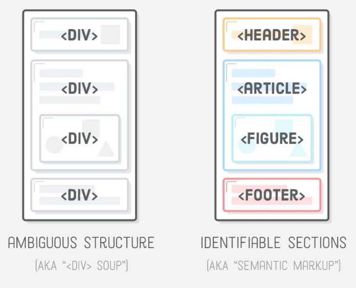

# Semantika - kodėl tai yra svarbu?

**nav**, **figure**, **footer**, **section**, **artcle**, **aside**, **header** ir t.t. naudojami kaip alternatyva 
 elementams ir yra svarbus šiuolaikinio žiniatinklio kūrimo aspektas, nes paieškos sistemoms, ekrano skaitytuvams ir kitoms mašinoms lengviau atpažinti skirtingas svetainės dalis. Tai taip pat padeda jums, kaip kūrėjui, tvarkyti svetainę, o tai savo ruožtu palengvina jos priežiūrą.

---

---

[https://learn-the-web.algonquindesign.ca/topics/html-semantics-checklist/](https://learn-the-web.algonquindesign.ca/topics/html-semantics-checklist/)

[https://html-lint.com/](https://html-lint.com/)