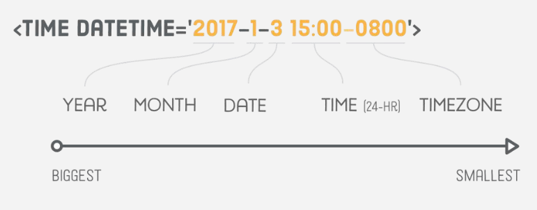

# time

Elementas `<time>` nurodo dienos laiką arba kalendoriaus datą. Pateikiant mašininio nuskaitymo datą, naršyklės gali automatiškai susieti ją su vartotojų kalendoriais ir padeda paieškos sistemoms aiškiai nustatyti konkrečias datas.

---

```html
<p>
    By a goog dude. Published <time>January 22nd</time>
</p>
```

---


